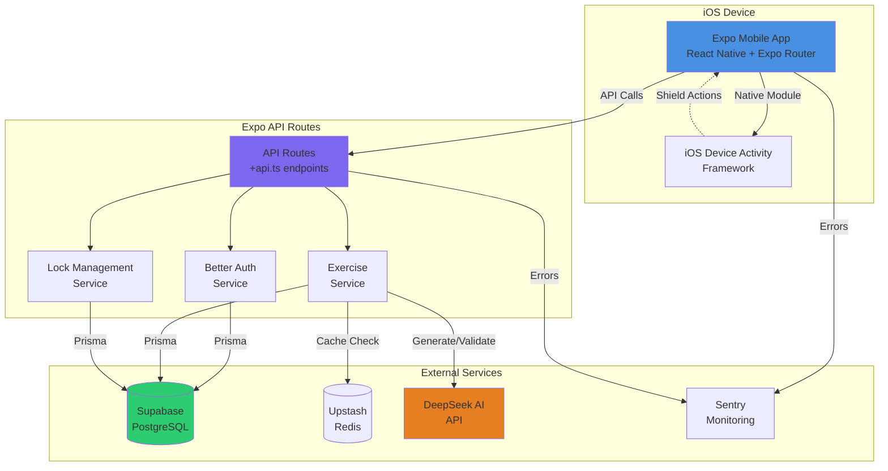
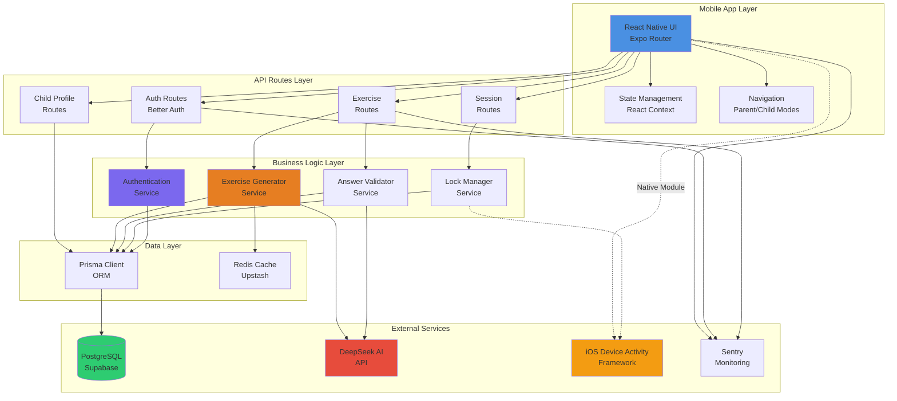
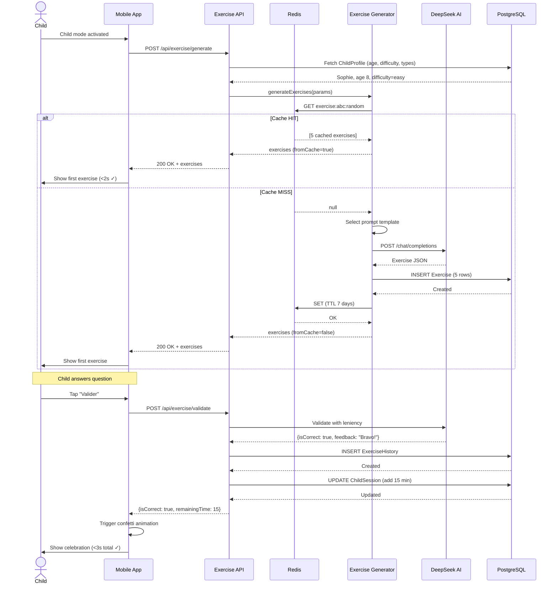
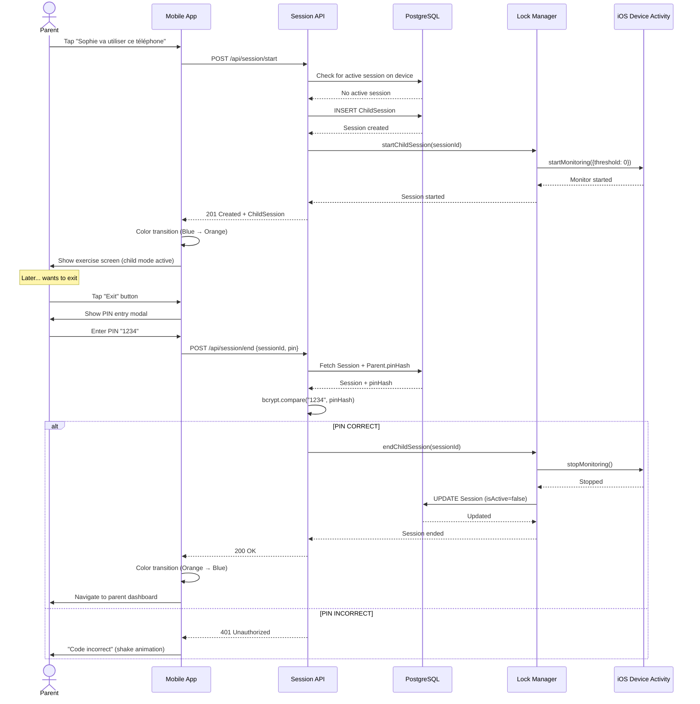

# KidGuard Fullstack Architecture Document

## Introduction

This document outlines the complete fullstack architecture for **KidGuard**, including backend systems, frontend implementation, and their integration. It serves as the single source of truth for AI-driven development, ensuring consistency across the entire technology stack.

This unified approach combines what would traditionally be separate backend and frontend architecture documents, streamlining the development process for modern fullstack applications where these concerns are increasingly intertwined.

### Starter Template or Existing Project

**Status:** N/A - Greenfield project

The PRD specifies a custom Expo setup with specific libraries (Better Auth, react-native-device-activity, DeepSeek integration). No starter template is mentioned. This is a greenfield iOS-first mobile application.

**Recommendation:** While T3 Stack or similar Expo starters exist, the unique requirements (Device Activity framework, Better Auth, DeepSeek AI) make a custom setup more appropriate than forcing a template.

### Change Log

| Date | Version | Description | Author |
|------|---------|-------------|--------|
| 2025-01-03 | 1.0 | Initial architecture document created | Winston (Architect) |

---

## High Level Architecture

### Technical Summary

KidGuard is an **iOS-native mobile application** built with Expo and React Native, using an **integrated API routes pattern** where backend endpoints coexist with frontend code in a single monorepo. The architecture employs a **serverless backend-for-frontend (BFF) pattern** through Expo API Routes, with all business logic deployed as part of the mobile app bundle to EAS.

The **frontend** uses Expo Router for navigation with dual UX modes (parent and child interfaces), React Native animations for gamification, and i18next for French localization. The **backend** leverages Expo API Routes (`+api.ts` suffix) for RESTful endpoints, Prisma ORM for type-safe database access to PostgreSQL (Supabase), Redis (Upstash) for exercise caching, and Better Auth for parent authentication. **External integrations** include DeepSeek AI for French exercise generation and validation, and iOS Device Activity framework via react-native-device-activity for app blocking enforcement.

The system achieves PRD goals through automatic screen time enforcement tied to AI-validated exercises, eliminating parental supervision burden while transforming conflict into educational engagement. **Deployment** targets EAS (Expo Application Services) with over-the-air update capability, optimized for rapid iteration during French market validation.

### Platform and Infrastructure Choice

**Platform:** Expo Application Services (EAS) + Supabase

**Key Services:**
- **Mobile App Hosting:** EAS Build, Submit, and Update for iOS distribution
- **Database:** Supabase PostgreSQL with Accelerate (connection pooling + edge caching)
- **Caching/Sessions:** Upstash Redis (serverless, globally distributed)
- **Authentication:** Better Auth (integrated via Expo API Routes)
- **AI Services:** DeepSeek API (REST integration)
- **Native iOS:** Device Activity Framework (via react-native-device-activity)
- **Monitoring:** Sentry (error tracking), Expo Analytics or Mixpanel (user behavior)
- **CDN:** Expo CDN for assets, Cloudflare optional for API acceleration

**Deployment Host and Regions:**
- **Primary:** EU-West (Paris/Ireland) for GDPR compliance and French market latency
- **Database:** Supabase EU region
- **Redis:** Upstash EU multi-region

**Rationale:**
- **EAS** is purpose-built for Expo apps, eliminates separate backend infrastructure
- **Supabase** provides managed PostgreSQL with excellent Prisma support and built-in Accelerate
- **Upstash Redis** offers serverless pricing (pay-per-request) ideal for MVP cost control
- **EU regions** ensure GDPR-K compliance for children's data privacy
- **No AWS/Azure/GCP** needed - Expo + Supabase handles all infrastructure at lower complexity

### Repository Structure

**Structure:** Monorepo (single Expo application)

**Monorepo Tool:** Expo's built-in workspace features (no Turborepo/Nx needed for MVP)

**Package Organization:**
```
├── app/                          # Expo Router - UI routes and API routes
│   ├── (auth)/                   # Auth screens (login, register)
│   ├── (parent)/                 # Parent mode screens
│   ├── (child)/                  # Child mode screens
│   └── api/                      # Backend API routes (+api.ts files)
│       ├── auth/[...auth]+api.ts # Better Auth endpoints
│       ├── exercise/             # Exercise generation/validation
│       ├── child/                # Child profile management
│       └── parent/               # Parent dashboard data
├── lib/                          # Shared business logic
│   ├── services/                 # DeepSeek, auth, database services
│   ├── types/                    # TypeScript interfaces (shared FE/BE)
│   ├── utils/                    # Common utilities
│   └── prompts/                  # DeepSeek prompt templates
├── prisma/                       # Database schema and migrations
│   └── schema.prisma
├── locales/                      # i18n translations
│   └── fr.json
├── assets/                       # Images, animations (Lottie), fonts
├── components/                   # Reusable UI components
└── hooks/                        # Custom React hooks
```

**Rationale:**
- Expo's file-based routing handles both UI and API in a single structure
- No need for complex monorepo tooling (Nx/Turborepo) for a single-app project
- `/lib` provides clear separation of business logic from presentation
- Shared `/lib/types` ensures type safety across frontend and API routes

### High Level Architecture Diagram



### Architectural Patterns

- **Jamstack-Inspired Mobile Architecture:** Static UI generation with dynamic API routes - _Rationale:_ Expo's file-based routing mirrors Jamstack principles, enabling fast initial load and OTA updates for content without App Store review cycles

- **Backend-for-Frontend (BFF) via API Routes:** Single-purpose API layer tailored for mobile client - _Rationale:_ Expo API Routes eliminate need for separate backend, reducing latency and deployment complexity while maintaining type safety

- **Component-Based UI with Atomic Design:** Reusable React Native components organized by complexity - _Rationale:_ Supports dual UX modes (parent/child) with shared primitives, enables consistent design system across 11 core screens

- **Repository Pattern for Data Access:** Prisma ORM abstracts database operations - _Rationale:_ Type-safe queries prevent runtime errors, enables future database migration flexibility, simplifies testing with mock repositories

- **Cache-Aside Pattern:** Redis caching with lazy population - _Rationale:_ Reduces DeepSeek API costs by 80%+ through exercise pre-caching, improves response times to <2s target

- **Circuit Breaker for External APIs:** Fallback exercise bank when DeepSeek unavailable - _Rationale:_ Ensures app functionality during API outages, critical for user trust in parental controls

- **Event-Driven State Management:** React Context + useReducer for app-wide state - _Rationale:_ Lightweight alternative to Redux, sufficient for MVP scope, supports parent/child mode switching without prop drilling

- **Native Module Bridge Pattern:** react-native-device-activity wraps iOS frameworks - _Rationale:_ Isolates platform-specific code, enables graceful degradation if entitlement approval delayed

---

## Tech Stack

This is the **DEFINITIVE technology selection** for the entire project. This table is the single source of truth - all development must use these exact versions.

| Category | Technology | Version | Purpose | Rationale |
|----------|-----------|---------|---------|-----------|
| **Frontend Language** | TypeScript | 5.3+ | Type-safe React Native development | Prevents runtime errors, enables IntelliSense, essential for shared types between FE/BE |
| **Frontend Framework** | Expo SDK | 51+ | React Native framework with managed workflow | Simplifies native module integration, provides API routes, enables OTA updates, best-in-class DX |
| **UI Component Library** | React Native Paper | 5.12+ | Material Design components for React Native | Production-ready components, accessibility built-in, supports theming for parent/child modes |
| **State Management** | React Context + useReducer | Built-in | App-wide state (auth, child mode, time bank) | Sufficient for MVP complexity, zero dependencies, native React patterns |
| **Backend Language** | TypeScript | 5.3+ | Type-safe API route development | Shared types with frontend, prevents API contract drift |
| **Backend Framework** | Expo API Routes | Expo 51+ | File-based API endpoints within Expo app | Zero backend deployment, automatic type inference, co-located with frontend |
| **API Style** | REST | N/A | RESTful HTTP endpoints | Simple, well-understood, sufficient for CRUD operations, no GraphQL complexity needed |
| **Database** | PostgreSQL | 15+ | Primary relational database | ACID compliance for critical parental controls, excellent Prisma support, JSON fields for flexibility |
| **Cache** | Upstash Redis | Latest | Exercise caching, session storage, rate limiting | Serverless pricing model, global replication, 99.99% uptime, cost-effective for MVP |
| **File Storage** | Expo CDN | Built-in | Static assets (images, Lottie animations) | Automatic optimization, global CDN, no separate S3 needed for MVP |
| **Authentication** | Better Auth | 1.0+ | Parent email/password authentication | Modern auth library, Expo-compatible, supports email verification, cleaner than NextAuth |
| **Frontend Testing** | Jest + React Native Testing Library | Latest | Component and hook testing | Industry standard, Expo built-in support, excellent async testing utilities |
| **Backend Testing** | Jest + Supertest | Latest | API route integration testing | Same test runner as frontend, Supertest for HTTP assertions |
| **E2E Testing** | Manual (Phase 2: Detox) | N/A | Critical user journey validation | Manual testing acceptable for MVP, Detox deferred to reduce complexity |
| **Build Tool** | EAS Build | Latest | Cloud-based iOS builds | Handles provisioning, signing, entitlements automatically |
| **Bundler** | Metro | Expo default | JavaScript bundling for React Native | Optimized for React Native, required by Expo |
| **IaC Tool** | Manual (Phase 2: Terraform) | N/A | Infrastructure provisioning | Supabase/Upstash managed services reduce IaC need for MVP |
| **CI/CD** | GitHub Actions | N/A | Automated testing and EAS builds | Free for public repos, excellent Expo integration, familiar workflow |
| **Monitoring** | Sentry | Latest | Error tracking and crash reporting | Real-time alerts, source maps support, React Native SDK, performance monitoring |
| **Logging** | Expo Dev Tools + Sentry | Built-in | Development logs and production errors | Expo logs for dev, Sentry breadcrumbs for production debugging |
| **CSS Framework** | Tailwind RN (nativewind) | 4.0+ | Utility-first styling for React Native | Rapid UI development, consistent spacing, easy theming for dual modes |
| **ORM** | Prisma | 5.9+ | Type-safe database client | Auto-generated types, migration management, excellent PostgreSQL support |
| **i18n Library** | react-i18next | 14+ | French localization | Industry standard, supports pluralization, lazy loading, easy JSON management |
| **Animation Library** | Lottie (lottie-react-native) | 6.5+ | Celebration animations and micro-interactions | Lightweight vector animations, 60fps performance, designer-friendly |
| **HTTP Client** | Fetch API + expo-api-routes client | Built-in | API communication | Native fetch sufficient, Expo provides typed client for API routes |
| **Native Module** | react-native-device-activity | 1.0+ | iOS Device Activity framework wrapper | Only library supporting Family Controls APIs, critical blocker dependency |
| **Environment Config** | expo-constants + dotenv | Built-in | Secure environment variable management | Build-time variable injection, prevents secret exposure |

---

## Data Models

Based on the PRD requirements, the following core data models will be shared between frontend and backend. These TypeScript interfaces will live in `/lib/types` and inform the Prisma schema.

### ParentUser

**Purpose:** Represents a parent account with authentication credentials and settings. One parent can manage multiple children. Stores PIN for child mode exit and account preferences.

**Key Attributes:**
- `id`: string (UUID) - Primary identifier
- `email`: string - Unique email for authentication
- `emailVerified`: boolean - Email verification status
- `pinHash`: string - Hashed 4-digit PIN for child mode exit
- `createdAt`: Date - Account creation timestamp
- `updatedAt`: Date - Last modification timestamp

#### TypeScript Interface

```typescript
interface ParentUser {
  id: string;
  email: string;
  emailVerified: boolean;
  pinHash: string; // bcrypt hashed, never plain text
  locale: string; // 'fr' for MVP
  createdAt: Date;
  updatedAt: Date;
}
```

#### Relationships
- Has many `ChildProfile` (one-to-many)
- Has many `ChildSession` (one-to-many)
- Has many `ExerciseFeedback` (one-to-many)

### ChildProfile

**Purpose:** Represents a child user with personalized settings for exercise generation, difficulty, time rewards, and app blocking preferences. Device-based access (no credentials).

**Key Attributes:**
- `id`: string (UUID) - Primary identifier
- `parentId`: string (FK to ParentUser) - Owning parent
- `name`: string - Child's first name
- `age`: number (6-14) - Age for difficulty calculation
- `avatar`: string | null - Optional avatar identifier
- `difficultyLevel`: enum ('easy', 'medium', 'hard') - Exercise difficulty
- `exerciseTypes`: string[] - Enabled subjects ['math', 'reading', 'logic', 'vocabulary']
- `timeRewardMinutes`: number (5-60) - Minutes earned per exercise
- `blockedAppCategories`: string[] - ['social', 'games', 'videos', 'all']
- `totalPoints`: number - Gamification points accumulated
- `totalStars`: number - Gamification stars earned
- `currentStreak`: number - Consecutive days with exercises
- `createdAt`: Date - Profile creation timestamp
- `updatedAt`: Date - Last modification timestamp

#### TypeScript Interface

```typescript
type DifficultyLevel = 'easy' | 'medium' | 'hard';
type ExerciseType = 'math' | 'reading' | 'logic' | 'vocabulary';
type AppCategory = 'social' | 'games' | 'videos' | 'all';

interface ChildProfile {
  id: string;
  parentId: string;
  name: string;
  age: number; // 6-14
  avatar: string | null;
  difficultyLevel: DifficultyLevel;
  exerciseTypes: ExerciseType[];
  timeRewardMinutes: number; // 5-60
  blockedAppCategories: AppCategory[];
  totalPoints: number;
  totalStars: number;
  currentStreak: number;
  createdAt: Date;
  updatedAt: Date;
}
```

#### Relationships
- Belongs to `ParentUser` (many-to-one)
- Has many `Exercise` (one-to-many)
- Has many `ExerciseHistory` (one-to-many)
- Has many `ChildSession` (one-to-many)

### Exercise

**Purpose:** Represents a generated exercise (from DeepSeek or fallback bank). Stores question, correct answer, hints, and metadata for validation and analytics.

**Key Attributes:**
- `id`: string (UUID) - Primary identifier
- `childId`: string (FK to ChildProfile) - Target child
- `type`: ExerciseType - Subject category
- `difficulty`: DifficultyLevel - Difficulty level
- `question`: string - Exercise prompt in French
- `correctAnswer`: string - Expected answer for validation
- `hints`: string[] - Progressive hints for incorrect attempts
- `metadata`: JSON - Additional context (age range, topic, DeepSeek model used)
- `isFallback`: boolean - True if from pre-generated bank
- `usedAt`: Date | null - Timestamp when presented to child
- `createdAt`: Date - Generation timestamp

#### TypeScript Interface

```typescript
interface Exercise {
  id: string;
  childId: string;
  type: ExerciseType;
  difficulty: DifficultyLevel;
  question: string;
  correctAnswer: string;
  hints: string[];
  metadata: {
    ageRange: string; // e.g., "6-8"
    topic?: string; // e.g., "addition", "synonyms"
    deepseekModel?: string; // API model version
    generatedAt: string; // ISO timestamp
  };
  isFallback: boolean;
  usedAt: Date | null;
  createdAt: Date;
}
```

#### Relationships
- Belongs to `ChildProfile` (many-to-one)
- Has many `ExerciseHistory` (one-to-many)
- Has many `ExerciseFeedback` (one-to-many)

### ExerciseHistory

**Purpose:** Tracks every exercise attempt with child's answer, validation result, and timing metrics. Used for analytics, parent dashboard, and AI quality monitoring.

**Key Attributes:**
- `id`: string (UUID) - Primary identifier
- `exerciseId`: string (FK to Exercise) - Exercise attempted
- `childId`: string (FK to ChildProfile) - Child who attempted
- `childAnswer`: string - Answer submitted by child
- `isCorrect`: boolean - Validation result
- `leniencyApplied`: boolean - True if AI applied age-appropriate leniency
- `feedback`: string - AI-generated feedback message
- `attemptNumber`: number - 1 for first attempt, 2 for retry
- `validationTimeMs`: number - API response time
- `attemptedAt`: Date - Submission timestamp

#### TypeScript Interface

```typescript
interface ExerciseHistory {
  id: string;
  exerciseId: string;
  childId: string;
  childAnswer: string;
  isCorrect: boolean;
  leniencyApplied: boolean;
  feedback: string;
  attemptNumber: number; // 1 or 2
  validationTimeMs: number;
  attemptedAt: Date;
}
```

#### Relationships
- Belongs to `Exercise` (many-to-one)
- Belongs to `ChildProfile` (many-to-one)

### FallbackExercise

**Purpose:** Pre-generated exercise bank for offline operation or DeepSeek API failures. 100 exercises across all subjects/difficulties.

**Key Attributes:**
- `id`: string (UUID) - Primary identifier
- `type`: ExerciseType - Subject category
- `difficulty`: DifficultyLevel - Difficulty level
- `ageRange`: string - Target age (e.g., "6-8")
- `question`: string - Exercise prompt
- `correctAnswer`: string - Expected answer
- `hints`: string[] - Progressive hints
- `reviewedBy`: string | null - QA reviewer name
- `createdAt`: Date - Creation timestamp

#### TypeScript Interface

```typescript
interface FallbackExercise {
  id: string;
  type: ExerciseType;
  difficulty: DifficultyLevel;
  ageRange: string; // "6-8", "9-11", "12-14"
  question: string;
  correctAnswer: string;
  hints: string[];
  reviewedBy: string | null; // QA validation
  createdAt: Date;
}
```

#### Relationships
- None (standalone reference data)

### ChildSession

**Purpose:** Tracks active child mode sessions for parent phone sharing. Stores current screen time balance, device ID, and session state for persistence across app restarts.

**Key Attributes:**
- `id`: string (UUID) - Primary identifier
- `childId`: string (FK to ChildProfile) - Active child
- `parentId`: string (FK to ParentUser) - Parent who activated
- `deviceId`: string - Unique device identifier
- `remainingTimeMinutes`: number - Current screen time balance
- `isActive`: boolean - Session currently active
- `deviceActivityMonitorName`: string | null - iOS monitor identifier
- `startedAt`: Date - Session activation timestamp
- `endedAt`: Date | null - Session termination timestamp

#### TypeScript Interface

```typescript
interface ChildSession {
  id: string;
  childId: string;
  parentId: string;
  deviceId: string;
  remainingTimeMinutes: number;
  isActive: boolean;
  deviceActivityMonitorName: string | null; // iOS Device Activity monitor ID
  startedAt: Date;
  endedAt: Date | null;
}
```

#### Relationships
- Belongs to `ChildProfile` (many-to-one)
- Belongs to `ParentUser` (many-to-one)

### ExerciseFeedback

**Purpose:** Captures parent-reported issues with exercise quality for AI improvement and content filtering.

**Key Attributes:**
- `id`: string (UUID) - Primary identifier
- `exerciseId`: string (FK to Exercise) - Flagged exercise
- `childId`: string (FK to ChildProfile) - Affected child
- `parentId`: string (FK to ParentUser) - Reporting parent
- `issueType`: enum - Category of issue
- `comment`: string | null - Optional parent comment
- `status`: enum - 'pending', 'reviewed', 'resolved'
- `createdAt`: Date - Report timestamp

#### TypeScript Interface

```typescript
type FeedbackIssueType =
  | 'too_difficult'
  | 'too_easy'
  | 'inappropriate'
  | 'wrong_answer'
  | 'other';

type FeedbackStatus = 'pending' | 'reviewed' | 'resolved';

interface ExerciseFeedback {
  id: string;
  exerciseId: string;
  childId: string;
  parentId: string;
  issueType: FeedbackIssueType;
  comment: string | null;
  status: FeedbackStatus;
  createdAt: Date;
}
```

#### Relationships
- Belongs to `Exercise` (many-to-one)
- Belongs to `ChildProfile` (many-to-one)
- Belongs to `ParentUser` (many-to-one)

---

## API Specification

Based on the Tech Stack selection (REST API), the following OpenAPI 3.0 specification defines all endpoints. The API routes live in `/app/api/` using Expo's `+api.ts` pattern with **standard Web Request/Response APIs**.

### File Structure Map (Expo API Routes)

```
app/api/
├── auth/
│   └── [...auth]+api.ts              # Better Auth catch-all
├── child/
│   ├── profile+api.ts                # GET (list), POST (create)
│   ├── [id]+api.ts                   # GET, PUT, DELETE
│   └── activity/
│       └── [childId]+api.ts          # GET
├── exercise/
│   ├── generate+api.ts               # POST
│   └── validate+api.ts               # POST
├── session/
│   ├── start+api.ts                  # POST
│   ├── end+api.ts                    # POST
│   └── current+api.ts                # GET
├── parent/
│   └── dashboard+api.ts              # GET
├── feedback+api.ts                   # POST
└── health+api.ts                     # GET
```

### Key Endpoints

**Authentication (Better Auth):**
- `POST /api/auth/sign-up` - Register new parent
- `POST /api/auth/sign-in` - Login parent
- `GET /api/auth/session` - Get current session

**Child Profile Management:**
- `GET /api/child/profile` - List all children
- `POST /api/child/profile` - Create child
- `GET /api/child/{id}` - Get specific child
- `PUT /api/child/{id}` - Update child
- `DELETE /api/child/{id}` - Delete child

**Exercise Operations:**
- `POST /api/exercise/generate` - Generate exercises (< 2s response time)
- `POST /api/exercise/validate` - Validate answer (< 3s response time)

**Session Management:**
- `POST /api/session/start` - Start child mode
- `POST /api/session/end` - End child mode (PIN-protected)
- `GET /api/session/current` - Get active session

**Analytics:**
- `GET /api/child/activity/{childId}` - Get activity stats
- `GET /api/parent/dashboard` - Dashboard overview

For complete OpenAPI specification, see appendix.

---

## Components

Based on the architectural patterns, tech stack, and data models, the following major logical components/services comprise the fullstack application.

### Component Diagram



### Mobile App (Frontend)

**Responsibility:** React Native UI for parent and child modes, navigation, state management, and API consumption. Dual UX implementation with mode switching, animations, and French localization.

**Key Interfaces:**
- Expo Router navigation (file-based routes in `/app`)
- React Context API for global state (auth, child mode, session)
- API client services for backend communication
- Native module bridge to Device Activity framework

**Technology Stack:** React Native + Expo SDK 51+, TypeScript, Expo Router, React Native Paper, nativewind, react-i18next, Lottie

### API Routes Layer (Backend-for-Frontend)

**Responsibility:** RESTful API endpoints for authentication, child management, exercise generation/validation, session control, and analytics. Orchestrates business logic, database access, external API calls, and caching.

**Key Interfaces:**
- Exposes REST API endpoints via Expo API Routes (`+api.ts` files)
- Standard Web Request/Response API
- Authentication via Better Auth middleware
- Rate limiting via Redis

**Technology Stack:** Expo API Routes (TypeScript), Better Auth 1.0+, Prisma ORM 5.9+, Node.js fetch API

### Exercise Generation Service

**Responsibility:** Generate age-appropriate French exercises using DeepSeek AI. Manages prompt templates, caching strategy, fallback exercise bank, and quality monitoring.

**Key Interfaces:**
- `generateExercise(childId, subjectType?, count?)` - Main generation function
- `getFallbackExercise(difficulty, type)` - Retrieves pre-generated exercise
- Prompt template system in `/lib/prompts/`

**Technology Stack:** DeepSeek API client (HTTP fetch), Redis cache-aside pattern, Prisma ORM for fallback exercises

### Answer Validation Service

**Responsibility:** Validate child answers using DeepSeek AI with age-appropriate leniency. Handles spelling variations, synonyms, partial correctness, and French language nuances.

**Key Interfaces:**
- `validateAnswer(exerciseId, childAnswer, attemptNumber)` - Main validation function
- `applyLeniency(age, answer)` - Age-based leniency rules
- Exact string match fallback for API failures

**Technology Stack:** DeepSeek API client, Prisma ORM, String normalization utilities

### Lock Management Service

**Responsibility:** Manages child sessions, screen time tracking, and iOS Device Activity monitor lifecycle. Handles session start/end, time balance updates, and persistence across app restarts.

**Key Interfaces:**
- `startChildSession(childId, deviceId)` - Activate child mode
- `endChildSession(sessionId, pin)` - Exit child mode with PIN validation
- `updateScreenTime(sessionId, minutesToAdd)` - Award time after exercise
- Device Activity monitor control (start/stop monitoring)

**Technology Stack:** Prisma ORM, react-native-device-activity SDK, iOS Shield Configuration/Action APIs

---

## External APIs

### DeepSeek AI API

**Purpose:** Generate age-appropriate French educational exercises and validate child answers with intelligent leniency. Primary AI provider for MVP due to cost-effectiveness compared to OpenAI/Anthropic.

**Documentation:** https://platform.deepseek.com/docs

**Base URL:** `https://api.deepseek.com/v1`

**Authentication:** API Key (Bearer token) stored in `DEEPSEEK_API_KEY` environment variable

**Rate Limits:**
- Free tier: 10 requests/minute, 200 requests/day
- Paid tier: 60 requests/minute, unlimited daily (recommended for production)
- Cost: ~$0.14 per 1M input tokens, ~$0.28 per 1M output tokens

**Key Endpoints Used:**
- `POST /chat/completions` - Generate exercises and validate answers

**Integration Notes:**
- Exercise caching strategy: Cache up to 10 exercises per child per subject in Redis (7-day TTL)
- Fallback exercise bank: Pre-generate 100 exercises across all subjects/age groups for offline scenarios
- Retry logic: Max 3 retries with exponential backoff (1s, 2s, 4s)
- Cost optimization: Redis caching reduces API calls by ~80%
- Estimated cost: ~$2-5/month for 1,000 active users

**Quality Monitoring:**
- Track validation accuracy via ExerciseFeedback table
- Alert if inappropriate content flagged (>5 reports/day)
- Target: <5% parent-reported quality issues (NFR3)

### iOS Device Activity Framework API

**Purpose:** Enforce app blocking on iOS devices based on screen time limits. Core functionality for parental controls and automatic enforcement.

**Documentation:**
- Apple DeviceActivity Framework: https://developer.apple.com/documentation/deviceactivity
- react-native-device-activity: https://github.com/kingstinct/react-native-device-activity

**Authentication:** Requires Apple "Family Controls (Distribution)" entitlement (1-2 week approval process)

**Rate Limits:**
- Maximum 20 concurrent activity monitors per device (hard iOS limit)
- Event naming constraints (avoid generic names)

**Key APIs Used:**
- `startMonitoring()` - Create activity monitor
- `stopMonitoring()` - End monitoring
- `ShieldConfiguration` - Customize blocking screen
- `ShieldAction` - Handle shield button taps

**Critical Setup Requirements:**
1. Request entitlement from Apple Developer portal
2. Configure `app.json` with Family Controls entitlement
3. Run `npx expo prebuild --platform ios` (native code generation required)
4. Physical device testing mandatory (simulator not supported)

**Known Issues:**
- SwiftUI app selection view can be crash-prone (implement error handling)
- 20 monitor limit requires session cleanup strategy
- Simulator unsupported for all testing

---

## Core Workflows

Key system workflows illustrated with sequence diagrams showing component interactions, external APIs, and error handling paths.

### Exercise Generation and Validation Flow



### Phone Sharing Mode Flow



---

## Database Schema

Transforming the conceptual data models into a concrete Prisma schema for PostgreSQL deployment on Supabase.

### Prisma Schema Definition

```prisma
// prisma/schema.prisma

generator client {
  provider = "prisma-client-js"
  previewFeatures = ["driverAdapters"]
}

datasource db {
  provider = "postgresql"
  url      = env("DATABASE_URL") // Supabase Accelerate connection string
}

// ========================================
// Parent User & Authentication
// ========================================

model ParentUser {
  id            String   @id @default(uuid())
  email         String   @unique
  emailVerified Boolean  @default(false)
  pinHash       String   // bcrypt hashed 4-digit PIN
  locale        String   @default("fr")
  createdAt     DateTime @default(now())
  updatedAt     DateTime @updatedAt

  // Relations
  children         ChildProfile[]
  sessions         ChildSession[]
  exerciseFeedback ExerciseFeedback[]

  @@map("parent_users")
}

// ========================================
// Child Profile & Settings
// ========================================

model ChildProfile {
  id                    String   @id @default(uuid())
  parentId              String
  name                  String
  age                   Int // 6-14
  avatar                String?
  difficultyLevel       DifficultyLevel @default(MEDIUM)
  exerciseTypes         ExerciseType[]
  timeRewardMinutes     Int      @default(15) // 5-60
  blockedAppCategories  String[]
  blockedAppsToken      String?  // iOS FamilyActivitySelection token

  // Gamification
  totalPoints           Int      @default(0)
  totalStars            Int      @default(0)
  currentStreak         Int      @default(0)

  createdAt             DateTime @default(now())
  updatedAt             DateTime @updatedAt

  // Relations
  parent           ParentUser         @relation(fields: [parentId], references: [id], onDelete: Cascade)
  exercises        Exercise[]
  exerciseHistory  ExerciseHistory[]
  sessions         ChildSession[]
  feedback         ExerciseFeedback[]

  @@index([parentId])
  @@index([parentId, createdAt])
  @@map("child_profiles")
}

enum DifficultyLevel {
  EASY
  MEDIUM
  HARD
}

enum ExerciseType {
  MATH
  READING
  LOGIC
  VOCABULARY
}

// ========================================
// Exercise Generation & Storage
// ========================================

model Exercise {
  id             String       @id @default(uuid())
  childId        String
  type           ExerciseType
  difficulty     DifficultyLevel
  question       String       @db.Text
  correctAnswer  String
  hints          String[]
  metadata       Json
  isFallback     Boolean      @default(false)
  disabled       Boolean      @default(false)
  usedAt         DateTime?
  createdAt      DateTime     @default(now())

  // Relations
  child           ChildProfile      @relation(fields: [childId], references: [id], onDelete: Cascade)
  exerciseHistory ExerciseHistory[]
  feedback        ExerciseFeedback[]

  @@index([childId, createdAt])
  @@index([childId, type, usedAt])
  @@map("exercises")
}

// ========================================
// Exercise History & Analytics
// ========================================

model ExerciseHistory {
  id                String   @id @default(uuid())
  exerciseId        String
  childId           String
  childAnswer       String
  isCorrect         Boolean
  leniencyApplied   Boolean  @default(false)
  feedback          String   @db.Text
  attemptNumber     Int      @default(1)
  validationTimeMs  Int
  attemptedAt       DateTime @default(now())

  // Relations
  exercise Exercise      @relation(fields: [exerciseId], references: [id], onDelete: Cascade)
  child    ChildProfile  @relation(fields: [childId], references: [id], onDelete: Cascade)

  @@index([childId, attemptedAt])
  @@index([exerciseId])
  @@index([attemptedAt])
  @@map("exercise_history")
}

// ========================================
// Fallback Exercise Bank
// ========================================

model FallbackExercise {
  id             String          @id @default(uuid())
  type           ExerciseType
  difficulty     DifficultyLevel
  ageRange       String
  question       String          @db.Text
  correctAnswer  String
  hints          String[]
  reviewedBy     String?
  createdAt      DateTime        @default(now())

  @@index([type, difficulty, ageRange])
  @@map("fallback_exercises")
}

// ========================================
// Child Session Management
// ========================================

model ChildSession {
  id                         String    @id @default(uuid())
  childId                    String
  parentId                   String
  deviceId                   String
  remainingTimeMinutes       Float     @default(0)
  isActive                   Boolean   @default(true)
  deviceActivityMonitorName  String?
  startedAt                  DateTime  @default(now())
  endedAt                    DateTime?

  // Relations
  child  ChildProfile @relation(fields: [childId], references: [id], onDelete: Cascade)
  parent ParentUser   @relation(fields: [parentId], references: [id], onDelete: Cascade)

  @@index([deviceId, isActive])
  @@index([childId, isActive])
  @@index([startedAt])
  @@map("child_sessions")
}

// ========================================
// Exercise Quality Feedback
// ========================================

model ExerciseFeedback {
  id         String             @id @default(uuid())
  exerciseId String
  childId    String
  parentId   String
  issueType  FeedbackIssueType
  comment    String?            @db.Text
  status     FeedbackStatus     @default(PENDING)
  createdAt  DateTime           @default(now())

  // Relations
  exercise Exercise      @relation(fields: [exerciseId], references: [id], onDelete: Cascade)
  child    ChildProfile  @relation(fields: [childId], references: [id], onDelete: Cascade)
  parent   ParentUser    @relation(fields: [parentId], references: [id], onDelete: Cascade)

  @@index([exerciseId])
  @@index([status, createdAt])
  @@map("exercise_feedback")
}

enum FeedbackIssueType {
  TOO_DIFFICULT
  TOO_EASY
  INAPPROPRIATE
  WRONG_ANSWER
  OTHER
}

enum FeedbackStatus {
  PENDING
  REVIEWED
  RESOLVED
}
```

### Prisma Client Setup for Expo API Routes

**IMPORTANT:** Expo API Routes require per-request Prisma Client instantiation with Accelerate extension:

```typescript
// Every API route must follow this pattern:
import { PrismaClient } from '@prisma/client/edge';
import { withAccelerate } from '@prisma/extension-accelerate';

export async function GET(request: Request) {
  const prisma = new PrismaClient({
    datasourceUrl: process.env.DATABASE_URL,
  }).$extends(withAccelerate());

  try {
    // Database operations
    const result = await prisma.childProfile.findMany({ ... });
    return Response.json(result);
  } finally {
    // Always disconnect
    await prisma.$disconnect();
  }
}
```

---

## Frontend Architecture

### Component Organization

```text
components/
├── ui/                           # Reusable UI primitives
│   ├── Button.tsx
│   ├── Input.tsx
│   └── Card.tsx
├── parent/                       # Parent-mode specific
│   ├── ChildCard.tsx
│   ├── PhoneSharingButton.tsx
│   └── PinEntry.tsx
├── child/                        # Child-mode specific
│   ├── ExerciseCard.tsx
│   ├── SuccessAnimation.tsx
│   └── TimeBank.tsx
└── shared/                       # Used in both modes
    ├── Header.tsx
    └── ModeTransition.tsx
```

### State Management Architecture

**State Structure:**
```typescript
interface AppState {
  // Auth
  user: ParentUser | null;
  isAuthenticated: boolean;

  // Mode
  mode: 'parent' | 'child';
  activeChildId: string | null;
  activeSession: ChildSession | null;

  // UI
  isLoading: boolean;
  error: string | null;
}
```

**State Management:** React Context + useReducer

**Custom Hooks:**
- `useAuth()` - Authentication state
- `useChildMode()` - Child mode management
- `useExercise()` - Exercise generation/validation
- `useSession()` - Session management

### Routing Architecture

**File-based routing via Expo Router:**
```text
app/
├── (auth)/
│   ├── login.tsx
│   └── register.tsx
├── (parent)/
│   ├── dashboard.tsx
│   ├── children/[id].tsx
│   └── settings.tsx
├── (child)/
│   ├── exercise.tsx
│   └── celebration.tsx
└── index.tsx  # Entry with redirect logic
```

**Protected Routes:** Session check on app launch restores child mode if active

---

## Backend Architecture

### Service Architecture (Serverless)

Expo API Routes follow a **function-based architecture** (serverless pattern):

```text
app/api/
├── auth/[...auth]+api.ts         # Better Auth catch-all
├── child/
│   ├── profile+api.ts            # GET (list), POST (create)
│   └── [id]+api.ts               # GET, PUT, DELETE
├── exercise/
│   ├── generate+api.ts           # POST
│   └── validate+api.ts           # POST
└── session/
    ├── start+api.ts              # POST
    ├── end+api.ts                # POST (PIN-protected)
    └── current+api.ts            # GET
```

### Authentication and Authorization

**Auth Middleware Pattern:**
```typescript
export async function requireAuth(request: Request): Promise<string> {
  const session = await auth.api.getSession({
    headers: request.headers,
  });

  if (!session?.user?.id) {
    throw new Error('UNAUTHORIZED');
  }

  return session.user.id;
}
```

**PIN Validation:**
```typescript
import bcrypt from 'bcryptjs';

async function verifyPin(pin: string, hash: string): Promise<boolean> {
  return bcrypt.compare(pin, hash);
}
```

---

## Unified Project Structure

```plaintext
kidguard/
├── .github/workflows/            # CI/CD
├── app/                          # Expo Router
│   ├── (auth)/
│   ├── (parent)/
│   ├── (child)/
│   ├── api/
│   ├── _layout.tsx
│   └── index.tsx
├── components/
├── lib/
│   ├── api/
│   ├── auth.ts
│   ├── context/
│   ├── services/
│   ├── types/
│   └── utils/
├── hooks/
├── prisma/
│   └── schema.prisma
├── locales/
│   └── fr.json
├── assets/
├── tests/
├── docs/
├── .env.example
├── app.json
├── eas.json
├── package.json
└── README.md
```

---

## Development Workflow

### Local Development Setup

**Prerequisites:**
- Node.js 18.x or 20.x
- Expo CLI: `npm install -g expo-cli eas-cli`
- Xcode 14+ (macOS)
- Physical iOS device (Device Activity requires physical device)

**Initial Setup:**
```bash
git clone https://github.com/your-org/kidguard.git
cd kidguard
npm install
cp .env.example .env.local
# Edit .env.local with credentials
npm run db:generate
npm run db:migrate
npm run db:seed
npx expo prebuild --platform ios
npm start
```

**Development Commands:**
```bash
npm start              # Start Expo dev server
npm run ios            # iOS simulator (limited)
npm test               # Run tests
npm run db:migrate     # Database migration
npm run build:ios      # EAS build
```

### Environment Configuration

**Development (.env.local):**
```bash
DATABASE_URL="prisma://accelerate.prisma-data.net/?api_key=..."
REDIS_URL="redis://..."
DEEPSEEK_API_KEY="sk-..."
BETTER_AUTH_SECRET="..."
NODE_ENV="development"
```

**Production:** EAS Secrets via `eas secret:create`

---

## Deployment Architecture

### Deployment Strategy

**Frontend Deployment:**
- Platform: EAS Build + EAS Update + Apple App Store
- Build: `eas build --platform ios --profile production`
- CDN: Expo CDN (static assets)
- OTA Updates: `eas update --branch production`

**Backend Deployment:**
- Platform: Expo API Routes (bundled with app)
- No separate backend server
- Serverless execution model

### CI/CD Pipeline

**GitHub Actions:**
- `ci.yml` - Tests on PR
- `eas-build.yml` - Build on push to main
- `eas-update.yml` - OTA update on code changes
- `cleanup.yml` - Daily data retention (GDPR-K)

### Environments

| Environment | Purpose | Update Channel |
|-------------|---------|----------------|
| Development | Local development | N/A |
| Preview | TestFlight beta testing | `preview` |
| Production | App Store live | `production` |

---

## Security and Performance

### Security Requirements

**Frontend Security:**
- Secure storage via Expo SecureStore (encrypted)
- Input validation (Zod schemas)
- No XSS risk (React Native text rendering safe by default)

**Backend Security:**
- Input validation on all endpoints
- Rate limiting (10 req/min per user via Redis)
- Ownership validation (parent owns child resources)
- PIN security (bcrypt hashing, never plain text)

**Authentication Security:**
- Better Auth JWT tokens
- Session expiry: 7 days
- Email verification required
- PIN entry: 3 attempts then 30s lockout

### Performance Optimization

**Frontend Performance:**
- Bundle size target: < 10MB
- Lazy loading for non-critical screens
- Image caching (Expo CDN)
- 60fps animations (Lottie)

**Backend Performance:**
- Exercise generation: < 2 seconds (NFR20)
- Answer validation: < 3 seconds (NFR21)
- Dashboard queries: < 500ms
- Redis caching (80% API call reduction)
- Prisma Accelerate (connection pooling + edge caching)

---

## Testing Strategy

### Testing Pyramid

```text
                E2E Tests (Manual)
               /                \
              /  Integration      \
             /      Tests          \
            /________________________\
           /                          \
          /      Unit Tests            \
         /______________________________ \
```

**Distribution:**
- 70% Unit Tests (services, utils)
- 20% Integration Tests (API routes)
- 10% E2E Tests (manual checklist)

### Test Organization

```text
tests/
├── unit/
│   ├── services/
│   ├── components/
│   └── utils/
├── integration/
│   └── api/
└── e2e/
    └── manual-checklist.md
```

**Test Tools:**
- Jest + React Native Testing Library
- Manual E2E (Detox deferred to Phase 2)
- Coverage threshold: 70%

---

## Coding Standards

### Critical Fullstack Rules

- **Type Sharing:** Define shared types in `lib/types/`, never duplicate
- **Prisma Client:** Always instantiate per API route with `$disconnect()` in finally
- **API Calls:** Use API client, never direct fetch from components
- **Environment Variables:** Access via typed config, never `process.env` directly
- **Error Format:** Consistent structure: `{ error: { code, message, details } }`
- **Authentication:** Every protected route checks `auth.api.getSession()` first
- **Ownership Validation:** Verify parent owns child: `WHERE childId = ? AND parentId = ?`
- **French Language:** All user-facing strings in French via `locales/fr.json`
- **PIN Security:** Always bcrypt hash, never store/transmit plain text
- **Cache Invalidation:** Invalidate exercise cache when child settings change

### Naming Conventions

| Element | Convention | Example |
|---------|-----------|---------|
| Components | PascalCase | `ExerciseCard.tsx` |
| Hooks | camelCase + 'use' | `useChildMode.ts` |
| API Routes | kebab-case | `/api/child/profile+api.ts` |
| Database | snake_case | `child_profiles` |
| Functions | camelCase | `generateExercise()` |
| Types | PascalCase | `ChildProfile` |
| Enums | SCREAMING_SNAKE | `DIFFICULTY_LEVEL.EASY` |

---

## Error Handling Strategy

### Error Response Format

```typescript
interface ApiError {
  error: {
    code: string;          // Machine-readable
    message: string;       // User-friendly (French)
    details?: any;         // Optional additional context
    timestamp: string;     // ISO timestamp
    requestId: string;     // For Sentry tracking
  };
}
```

### Error Codes

- **401:** `UNAUTHORIZED`, `INVALID_PIN`, `SESSION_EXPIRED`
- **403:** `FORBIDDEN`, `OWNERSHIP_VIOLATION`
- **404:** `NOT_FOUND`, `CHILD_NOT_FOUND`
- **400:** `VALIDATION_ERROR`, `INVALID_AGE`
- **409:** `ACTIVE_SESSION_EXISTS`, `DUPLICATE_EMAIL`
- **429:** `RATE_LIMIT`
- **500:** `INTERNAL_ERROR`, `DATABASE_ERROR`
- **503:** `DEEPSEEK_UNAVAILABLE`

### Frontend Error Handling

```typescript
try {
  const result = await apiClient.validateAnswer({ ... });
} catch (error) {
  if (error instanceof ApiError) {
    setError(error.message); // French message
    Sentry.captureException(error);
  }
}
```

### Backend Error Handling

```typescript
export async function POST(request: Request) {
  try {
    // Business logic
  } catch (error) {
    if (error instanceof z.ZodError) {
      return createErrorResponse('VALIDATION_ERROR', 'Données invalides', 400);
    }

    console.error('Error:', error);
    Sentry.captureException(error);
    return createErrorResponse('INTERNAL_ERROR', 'Erreur serveur', 500);
  }
}
```

---

## Monitoring and Observability

### Monitoring Stack

- **Frontend Monitoring:** Sentry React Native SDK
- **Backend Monitoring:** Sentry (API route errors)
- **Error Tracking:** Sentry (real-time alerts)
- **Performance Monitoring:** Sentry performance tracing

### Key Metrics

**Frontend Metrics:**
- Core Web Vitals (N/A for native, but app launch time)
- JavaScript errors
- API response times
- User interactions (exercise completion, session start/end)

**Backend Metrics:**
- Request rate
- Error rate
- Response time (< 2s exercise, < 3s validation)
- Database query performance
- DeepSeek API costs

---

## Checklist Results Report

*(To be executed after architecture review)*

---

**Document Version:** 1.0
**Created:** 2025-01-03
**Author:** Winston (Architect)
**Status:** Ready for Review

---

🏗️ **Generated with BMAD™ Core Architecture Framework**
